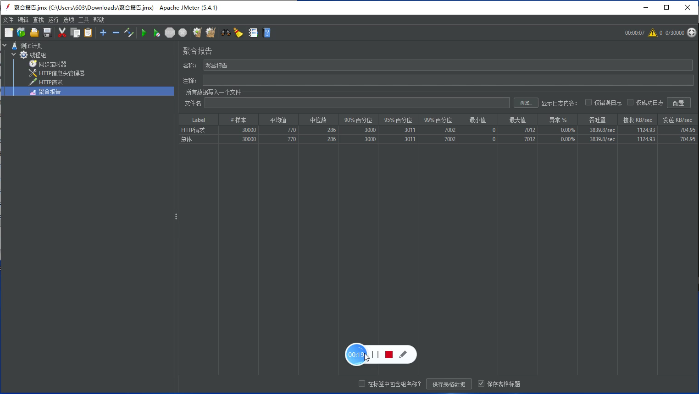
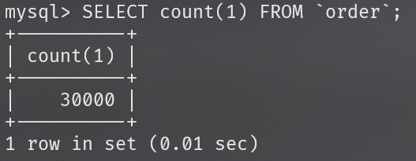
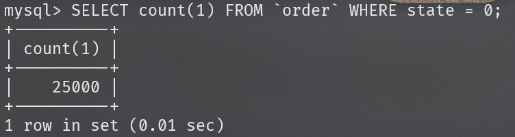
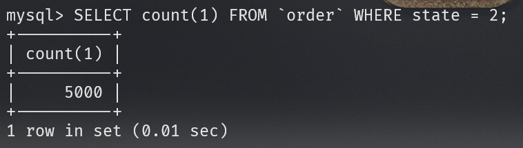
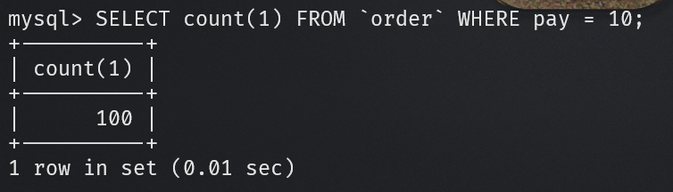
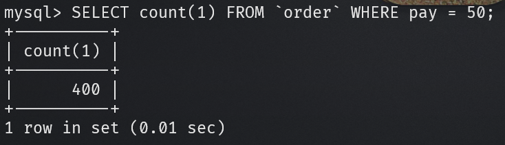
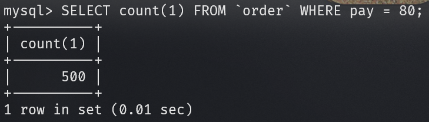
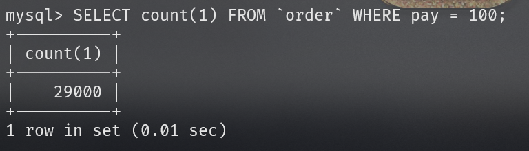

# 消息队列测试报告及JMeter压测说明

本次测试将使用JMeter对本团队开发的“想不出商城”系统内的购买服务进行测试。该服务对接了本团队自研的Flash-MQ消息队列引擎，通过测试该服务可对Flahs-MQ项目的消息丢失、消息重复、吞吐性能三大基本功能进行测试。

## 需要注意的是：

- 为模拟极端环境，加强对消息丢失率及消息重复率的严苛要求，单次购买流程将对消息队列进行4次发、收动作。若单次购买流程内的任何一次发、收动作异常，即本次购买失败。理论上在内部流程内，本次测试的吞吐量结果应*4计算。

- 因开发时间较短，本次的开发工作重心在消息队列之上，所以减少了对商城SpingBoot后端的性能优化，在吞吐量上，Flash-MQ理论性能应更加优秀。

## 测试环境

- 本次测试环境：Ryzen 4800U（8核16线程）、16GB内存笔记本*1台，内网通信。

我们为虚拟机分配4核8线程、8GB内存搭建CentOS7.5服务器环境。用来运行MySQL、Reids、Nginx、JVM等服务。

我们将剩余资源（4核8线程、8GB内存）用来运行JMeter测压程序，对虚拟机内服务进行测压，用来模拟高并发情况。

## 测试流程

测试前准备：

1.

在模拟高并发的情况下，为解决Windows系统端口资源限制问题，需在注册表HKEY_LOCAL_MACHINE\SYSTEM\CurrentControlSet\Services\Tcpip\Parameters内新建DWORD，名为MaxUserPort，值为十进制65534，新建后重启电脑。

2. 因购买服务需用户登录，在测试之前需手动登录商城，获取cookies中的JSESSIONID。

3. 创建商品，价格为100，库存为25000（小于测试的并发数，测试超卖情况）。创建该商品的对应秒杀活动，第1-100名商品1折销售，第101-500名5折，第501-1000名8折，第1001名后商品原价销售。

JMeter设置：

1. 在JMeter建立线程组，考虑到模拟并发环境内存资源紧缺，我们将线程数设置为30000，Ramp-Up时间设置为10，其他参数默认不变。

   .png)

2. 在线程组内新建同步定时器，模拟用户组的数量为10000，其他参数默认不变。

   .png)

3. 在线程组内新建HTTP信息头管理器，添加键值对：

   | Key    | Value                               |
         | ------ | ----------------------------------- |
   | cookie | JSESSIONID=“刚刚获取到的JSESSIONID” |

   .png)

4. 在线程组内新建HTTP请求，参数如下表，其他默认参数不变

   | Key            | VALUE          | 备注                       |
         | -------------- | -------------- | -------------------------- |
   | 协议           | http           |                            |
   | 服务器名称或IP | 192.168.83.130 | 此处为虚拟机内网IP         |
   | 端口号         | 8000           | 此处为后端设置的端口       |
   | HTTP请求       | GET            |                            |
   | 路径           | /goods/2/buy   | 参数2为商品ID，此处以2为例 |
   | 内容编码       | utf-8          |                            |
   | 使用KeepAlive  | 勾选           | 防止信道资源不足导致异常   |

   .png)

5. 在线程组内新建聚合报告。

6. 运行，运行结束后查看并保存聚合报告。

## 测试结果

### 预期结果：

- 聚合报告

    - 零异常率
    - 吞吐量10000/4 = 2500/sec以上

- MySQL数据库

    - 订单记录数为30000（无少售/超售订单）
    - 状态字段‘state’第1-25000条为0（已创建待付款），250001条后为2（无库存已取消）（无少售/超售订单）
    - 实付字段‘pay’为100\*0.1=10共100条，为100\*0.5=50共400条，为100\*0.8=80共500条，第1001条后为100共29000条（秒杀的正确排序）

### 实测结果：

- 聚合报告

    - 异常率0.00%
    - 吞吐量3839.8/sec 结合分析公式结果为15359.2/sec

  

- MySQL数据库

- 订单记录数为30000（无少售/超售订单）

```sql
SELECT count(1)
FROM `order`;
```



- 状态字段‘state’25000条为0（已创建待付款），5000条后为2（无库存已取消）（无少售/超售订单）

```sql
SELECT count(1)
FROM `order`
WHERE state = 0;
```





- 实付字段‘pay’为100\*0.1=10共100条，为100\*0.5=50共400条，为100\*0.8=80共500条，第1001条后为100共29000条（秒杀的正确排序）

```sql
SELECT count(1)
FROM `order`
WHERE pay = 10;
SELECT count(1)
FROM `order`
WHERE pay = 50;
SELECT count(1)
FROM `order`
WHERE pay = 80;
SELECT count(1)
FROM `order`
WHERE pay = 100;
```









以上，均符合预期结果！！！

## 总结

在本次测试中，通过模拟高并发场景下请求购买服务，得到Flash-MQ在实际应用中的测试数据。所有数据均符合预期，验证了自研消息队列引擎Flash-MQ项目的消息零丢失、消息零重复、单机吞吐性能万级等基本特性。

