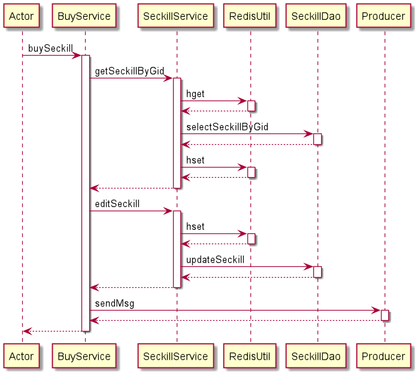
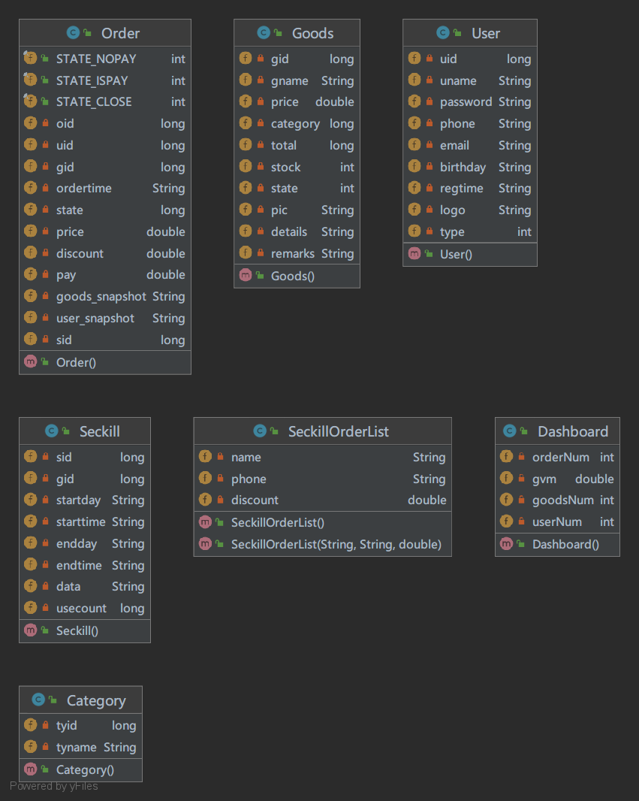

# 需求规格说明书及设计文档

## 项目场景

> 企业新产品进行线上发布销售，利用营销活动引流时，短时间内用户请求过多，流量暴增导致系统挂掉及出现商品超卖等现象。为了解决这一问题，企业要求定制设计一种“消息队列”进行流量削峰，模拟真实营销活动场景和现实需求进行压力测试。

本团队自行设计并实现一种“消息队列”来解决商品营销活动场景中突发流量过大容易宕机的问题。该消息队列项目命名为Flash-MQ。消息队列开发完成后，为了验证消息队列方案的可行性并测试该消息队列的性能我们开发了一套基于SpringBoot的前后端分离商城系统，下文简称“商城”。该系统支持普通商品购买及秒杀商品购买，两类商品的购买均对接了Flash-MQ。

## 功能

### 商城部分

#### 用户/管理员共有功能

1. 用户功能：
   1. 包括用户注册和登录
   2. 完善个人信息
   3. 修改密码/找回密码

2. 商品功能：
   1. 浏览商品信息，包括商品名称、价格、图片、详情等
   2. 若浏览的商品为秒杀商品可查看秒杀的规则及该商品现有订单的名单公示。
   3. 可购买普通商品和秒杀商品
   4. 可根据商品分类查看商品

3. 订单功能：
   1. 可查看本人所拥有的所有订单
   2. 可对本人拥有的订单进行付款或取消的操作

4. 人体工学功能：
   1. 前端统一现代化设计风格
   2. 前端采用非线性动画
   3. 前端支持暗黑模式（背景颜色反转）防止夜间刺眼

#### 管理员功能

1. 仪表盘功能：
   1. 显示订单总数、订单总额、商品总数、用户总数等常用统计数据
2. 订单管理功能：
   1. 全部订单统计列表，包含订单ID、商品ID、商品名称、订单时间、折扣、应付/实付、用户ID、用户名、手机号、状态等
   2. 查看该订单的用户快照、商品快照
   3. 删除订单
3. 商品管理功能：
   1. 全部商品信息列表，包含商品ID、名称、价格、分类、总库存、现有库存、备注、是否上架等
   2. 增删改查商品
   3. 上下架商品
4. 营销管理功能：
   1. 全部营销活动列表，包含活动ID、对应商品ID\商品名、开始时间、结束时间、已使用次数等
   2. 增删改查活动
   3. 可自定义开始/结束时间
   4. 可自定义秒杀优惠人数排名范围及折扣
5. 用户管理功能：
   1. 全部用户信息列表，包含用户ID、用户名、手机号、邮箱、生日、是否为管理员等
   2. 增删改查用户

### 消息队列部分

1. 实现消息队列的基本功能，包括PRODUCER-COMSUMER、PUBLISH-SUBSCRIBE
2. 实现JMS 2.0 的大部分特性
3. 支持 JMS 的基本消息类型
4. 支持 AUTO_ACKNOWLEDGE、CLIENT_ACKNOWLEDGE、DUPS_OK_ACKNOWLEDGE 三种 SessionMode
5. 非持久化的消息通过 Redis 的 publish 特性发送
6. 所有的 Queue 和 Topic 都可以被多个消费者监听，不支持互斥消费行为，所以 createSharedConsumer 的 API 用于创建监听非持久化消息的消息消费者了
7. 支持Java语言
8. 单机呑吐量万级
9. 消息丢失接近0
10. 消息重复可控
11. 文档完备（兼容JMS2.0的官方文档）

## 技术--商城部分

### 后端技术栈

- SpringBoot ：项目基础框架
- Mysql：关系型数据库服务
- JDBC+Mybatis：持久层服务框架
- Redis：非关系型数据库
- Redisson：Redis通信框架
- FastJSON：内部通信及序列化工具
- Maven ：项目构建系统
- Flash-MQ(自研消息队列)：消息队列
- Nginx：HTTP和反向代理web服务器

### 前端技术栈

- html +CSS +Javascript ES6：HTML5语言
- Vue：渐进式框架
- Vue Router：VUE路由插件
- VueX：VUE状态管理
- Axios ：一个基于 promise 的 HTTP 库，用于GET/POST请求
- Node.js+webpack：项目构建工具

### 技术介绍

#### 技术规格及应用介绍

本项目前端基于Vue渐进式框架开发，基本遵守HTML开发规范、Vue-Cli开发规范及Webpack开发规范；后端基于SpringBoot框架开发，基本遵守JAVA开发规范及SpringBoot开发建议。下面将从HTTP请求开始介绍本项目的技术特点。

1. 通过HTTP协议访问本商城，通过Nginx集群（比赛场景为Nginx单机）均衡负载返回页面

2. 页面内通过Axios提供的AJAX方式GET/POST请求页面内的数据

3. Nginx接收到请求地址及参数通过反向代理规则`^.+api/?(.*)$`指向localhost:8000 JAVA后端部分

4. 请求进入网关部分，检查该访问是否拥有对应权限，无权限则直接返回鉴权失败，有权限则继续

5. 进入对应Controller并对应调用Service

6. Service在数据方面优先调用Redis内缓存，Redis缓存数据类型大部分为Hash、小部分为String。若Redis内无对应缓存则调用Dao层访问Mysql数据库，获取数据后存入Redis缓存后返回数据到Service

7. Service经过业务逻辑后将结果返回Controller

8. Controller将接收到的结果包装成Result类，序列化为JSON后写入Response并返回

   此处的Result成员包含：

   - code：响应代码
   - meg：响应消息
   - data：响应数据
   - time：响应时间戳

9. 页面接收到数据保存至Vue-Data/VueX并渐进式显示到页面

需值得注意的是：

-
本项目中的购买服务接入了Flash-MQ（自研消息队列）若该请求为购买请求则会将购买服务所需的参数通过FastJSON序列化为JSON，将此JSON发送至购买服务相关队列，由购买服务监听器监听购买服务相关队列进行购买请求操作。同时购买服务将生成一串UUID字符串返回至前端，前端通过该UUID将自动轮询本次的订单生成状态。Flash-MQ拥有低延迟、无丢失、无重复、高可用性、可持续性、可集群等特点可轻松应对流量波峰。

#### 架构图

#### 购买服务时序图（按方法执行顺序排序）

1. buyCreate
   
2. buy
   
3. buyStock
   
4. buySeckill
   
5. buyOrder
   

#### 类图

1. interceptor
   
2. controller
   
3. service
   
4. dao
   
5. result
   
6. mq
   
7. redis
   
8. pojo
   

## 技术--Flash-MQ部分

基于 Redis 实现的 Java 消息服务，通过Redisson与Redis通信。支持 JMS 2.0 的部分特性。

### 支持特性

- 支持 JMS 的基本消息类型
- 支持 AUTO_ACKNOWLEDGE、CLIENT_ACKNOWLEDGE、DUPS_OK_ACKNOWLEDGE 三种 SessionMode
- 非持久化的消息通过 Redis 的 publish 特性发送
- 所有的 Queue 和 Topic 都可以被多个消费者监听，不支持互斥消费行为，所以 createSharedConsumer 的 API 用于创建监听非持久化消息的消息消费者了

### 不支持特性

- 不支持 JMS 1.x 消息发送/接收相关的 API
- 不支持事务
- 不支持设置 DisableMessageID，消息默认会生成一个消息ID，格式为`ID:Base64压缩后的UUID`
- 不支持 MessageSelector
- 暂不支持优先级队列
- 暂不支持延迟发送 (DeliveryDelay)

### 消息在Redis中的数据结构

 

